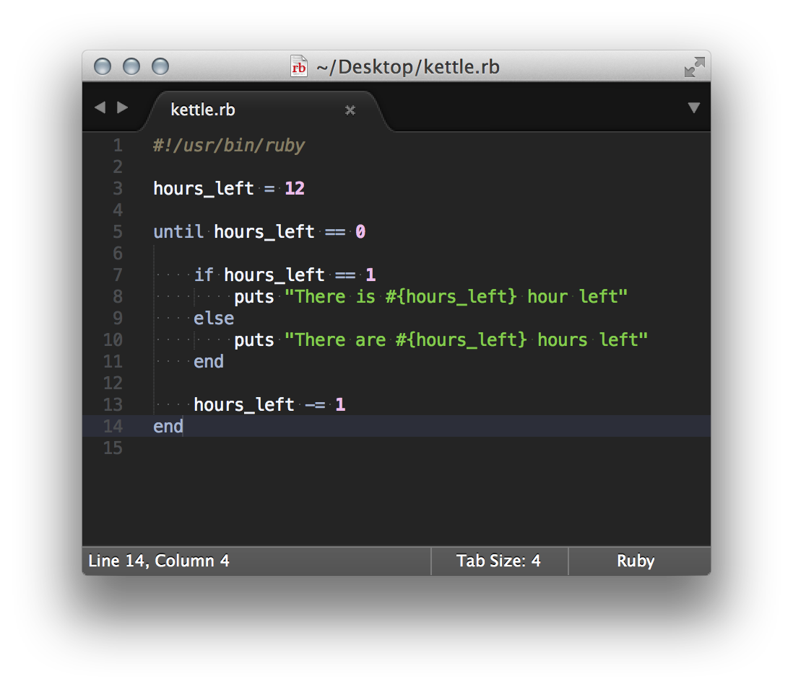
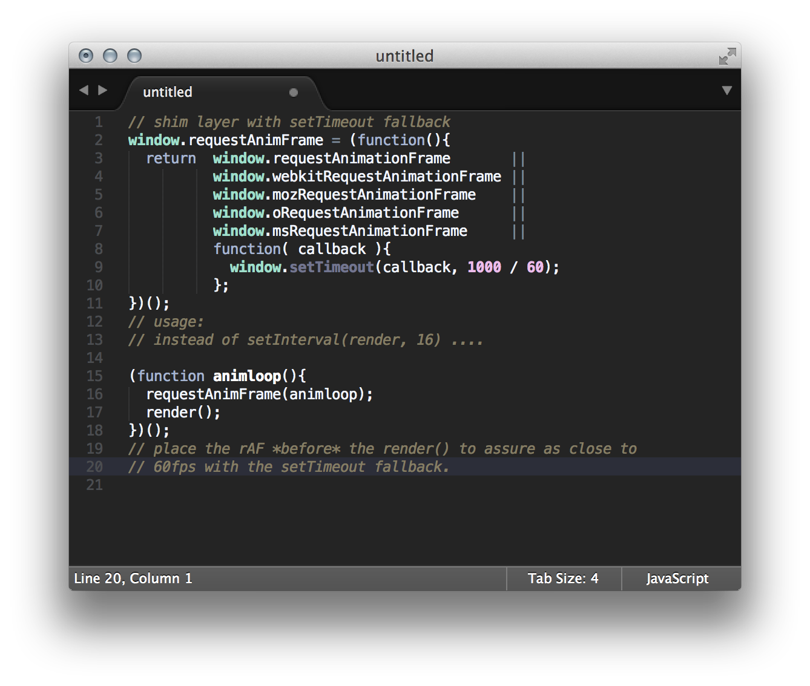
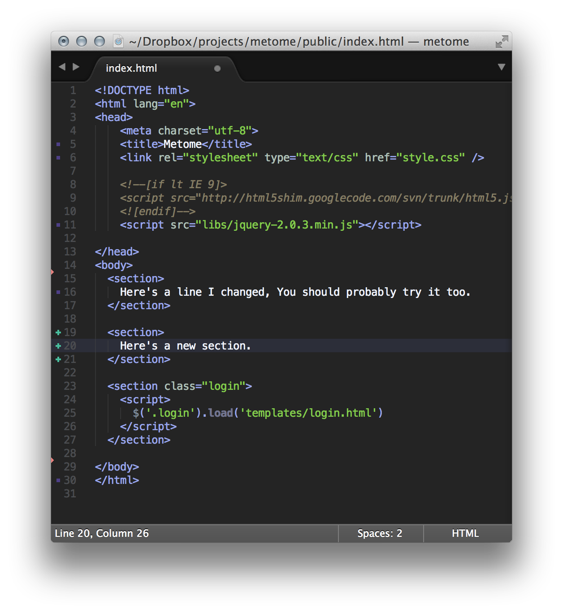
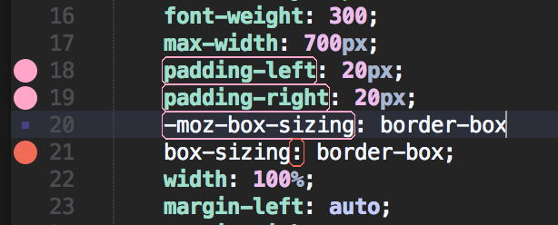

# Kettle Pot for Sublime

A color scheme designed to emphasize the code that matters.

Kettle Pot uses color sparingly to draw focus to strings, numbers, tags, and control flow. Comments recede but are easily distinguishable from code.

I use Menlo at 12px.

### Ruby

### Javascript

### HTML
Showing gitgutter custom color support

### CSS
Showing sublimelinter custom colors

It'll probably work pretty great in everything.

## Installation

Assuming you've already got [SublimeLinter][sl] and GitGutter[gg] installed:

1. Download or clone this repo
2. Copy `KettlePot.tmTheme` to `Sublime/User/Color Schemes`
3. Copy `SublimeLinter.sublime-settings` to `Sublime/User/`
4. Enable and Enjoy!

[sl]:http://www.sublimelinter.com/en/latest/installation.html
[gg]:http://www.jisaacks.com/gitgutter
